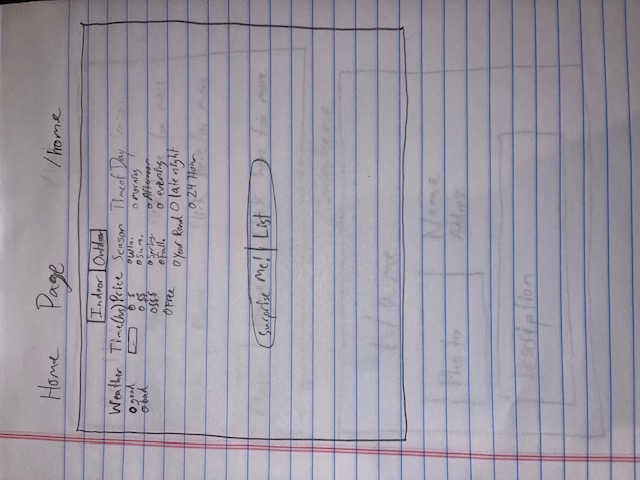

The content below is an example project proposal / requirements document. Replace the text below the lines marked "__TODO__" with details specific to your project. Remove the "TODO" lines.

(__TODO__: your project name_)

# Plan-See (working title)

## Overview

(__TODO__: a brief one or two paragraph, high-level description of your project_)

Whether it be with a significant other, friend, or family member, we've all had moments where we're sitting on the couch wishing we had something to do but not being able to thinnk of and/or decide on something. This is where Plan-See comes in. This application will provide a solution by tracking things to do based on the city you're in. They will all have tags that can be multiselected from the home page. Once you search you will be given a randomly generated activity based on the tags youve selected. The activity will have a picture, description, indoor/outdoor, optimal weather/temp, time the activity takes, operating hours and season(s) that the activity is available. You will also have the choice to see a list of activities that match rather than a single randomly generated activity. Basically, it Plans for you to See something.


## Data Model

(__TODO__: a description of your application's data and their relationships to each other_) 

The application will store Activities and descriptags

* Activities can have multiple descriptags (via references)
* each descriptag can have multiple items (by embedding)

(__TODO__: sample documents_)

An Example User:

```javascript
{
  selectionType: //list or randomly generated,
  //descriptags to follow
  indoor: //boolean,
  outdoor: // boolean
  winter:// boolean
  summer: // boolean
  spring: // boolean
  fall: // boolean
  yearRound: //boolean
  morning: //boolean
  afternoon: //boolean
  evening: //boolean
  lateNight: //boolean
  twentyFourHr: //boolean
  priceFree: //boolean
  priceCheap: //boolean
  priceModerate:  //boolean
  priceExpensive: //boolean
  time: //<1 hour, 1-2 hours, 2-3 hours, 3+ hours, as long as you want

}
```

An Example List with Embedded Items:

```javascript
{
  user: // mixture of boolean selections
  activity: "Harry Potter Store NYC",
  descriptags: [
    { indoor: true},
    { outdoor: false},
    {winter: true},
    {summer: true},
    {spring: true},
    {fall: true},
    {yearRound: true},
    {morning: true},
    {afternoon: true},
    {evening: true},
    {lateNight: false},
    {twentyFourHr: false},
    {priceFree: false},
    {priceCheap: false},
    {priceModerate: true},
    {priceExpensive: false}  ],
  description: // paragraph about experience
  address: //location of the activity
}
```


## [Link to Commented First Draft Schema](db.js) 

(__TODO__: create a first draft of your Schemas in db.js and link to it_)

## Wireframes

(__TODO__: wireframes for all of the pages on your site; they can be as simple as photos of drawings or you can use a tool like Balsamiq, Omnigraffle, etc._)

/home - page for selecting descriptags and other options



/options - page for showing a list of all options satisfying the requirements


/surprise- page for showing a randomly generated activity satisfying the requirements


/activities- page for showing all activities in the database

## Site map/

/bucketlists- page for showing all bucketlists specific to the user

## Site map

/bucketlists/create- page for creating a bucketlist specific to the user

## Site map

/activities/create- page for creating activities to add to the database

## Site map

(__TODO__: draw out a site map that shows how pages are related to each other_)

/home directs to either /surpriseme or /list depending on the selection from the home page. Both /surpriseme and /list will link to each other and /home.

## User Stories or Use Cases

(__TODO__: write out how your application will be used through [user stories](http://en.wikipedia.org/wiki/User_story#Format) and / or [use cases](https://www.mongodb.com/download-center?jmp=docs&_ga=1.47552679.1838903181.1489282706#previous)_)

1. as user, I can select options that best suit my desires for the activity
2. as a user, I can generate a list of all options that satisfies my requests
3. as a user, I can randomly generate a single activity that satisfies my requests
4. as a user, I can switch from a single activity to a list
5. as a user, I can switch from a list to a single activity
6. as a user, I can add activities to a bucket list

## Research Topics

(__TODO__: the research topics that you're planning on working on along with their point values... and the total points of research topics listed_)

* (3 points) Unit Testing with JavaScript
    * I'm going to test using Mocha
* (3 points) Using a JavaScript library or module not taught in class
    * see <code>cs.nyu.edu/~jversoza/ait-final/my-form</code>
    * env module
* (2 points) Use a CSS framework throughout your site
    * I used Tailwind to theme my site

8 points total out of 8 required points (___TODO__: addtional points will __not__ count for extra credit_)


## [Link to Initial Main Project File](app.js) 

(__TODO__: create a skeleton Express application with a package.json, app.js, views folder, etc. ... and link to your initial app.js_)

## Annotations / References Used

(__TODO__: list any tutorials/references/etc. that you've based your code off of_)

1. 
2. 

